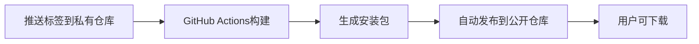

# 公开仓库自动发布设置指南

这个指南将帮你设置自动发布到公开仓库的功能。

## 1. 创建公开仓库

1. 在GitHub上创建一个新的**公开仓库**，例如：`auto-cursor-releases`
2. 仓库只需要一个简单的README，用于存放Release文件

## 2. 生成Personal Access Token (PAT)

1. 进入GitHub Settings → Developer settings → Personal access tokens → Tokens (classic)
2. 点击 "Generate new token (classic)"
3. 设置以下权限：
   - `public_repo` - 访问公开仓库
   - `write:packages` - 写入包（可选）
4. 复制生成的token（只显示一次，务必保存）

## 3. 配置私有仓库的Secrets

在你的私有仓库中：

1. 进入 Settings → Secrets and variables → Actions
2. 点击 "New repository secret"
3. 添加以下secret：
   - **Name**: `PUBLIC_REPO_TOKEN`
   - **Value**: 粘贴第2步生成的PAT

## 4. 修改工作流配置

编辑 `.github/workflows/release-to-public.yml` 文件：

```yaml
# 第102行，修改为你的公开仓库
repository: your-username/your-public-repo-name  # 例如：wuqi-y/auto-cursor-releases
```

## 5. 测试发布

创建并推送标签来测试：

```bash
git tag v1.0.0
git push origin v1.0.0
```

## 工作流程



## 最终效果

- 🔒 **私有仓库**: 保存源代码，只有你能访问
- 🌍 **公开仓库**: 只包含Release文件，任何人都能下载
- 🤖 **自动化**: 推送标签后自动构建并发布
- 📱 **易分享**: 可以直接分享公开仓库链接

## 示例公开仓库结构

```
auto-cursor-releases/
├── README.md (安装说明和下载链接)
└── Releases/
    ├── v1.0.0/
    │   ├── auto-cursor_x86_64.dmg
    │   ├── auto-cursor_aarch64.dmg
    │   └── auto-cursor.msi
    └── v1.0.1/
        ├── ...
```

## 常见问题

### Q: PAT权限不足？
A: 确保PAT有 `public_repo` 权限，并且你对目标公开仓库有写入权限。

### Q: 工作流失败？
A: 检查：
1. 公开仓库名称是否正确
2. `PUBLIC_REPO_TOKEN` secret是否配置正确
3. PAT是否过期

### Q: 如何自定义Release说明？
A: 编辑工作流文件中的 `body:` 部分。
